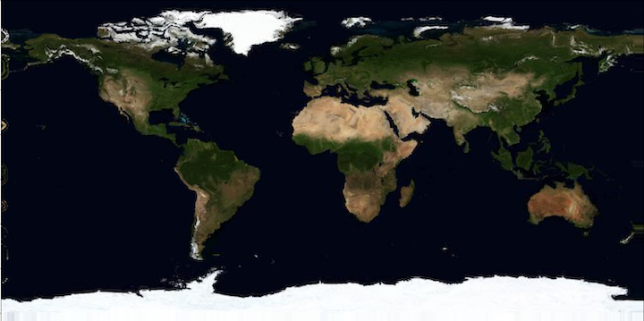

# AI Weiwei - AI Artist challenge @Climate Crisis Hackathon

_The [Climate Crisis AI Hackathon](https://www.eventbrite.com/e/climate-crisis-ai-hackathon-kickoff-conference-tickets-130078511329) is a 48-hour event over the weekend of January 22nd with additional workshops on the 18th and 19th. It brings together beginners and experts to tackle Climate Change related problems using AI. The AI Artist challenge proposes to transform climate and environmental data artistically to create beautiful visualizations, music or unique pieces of art._

# Our project

__Humans are reshaping the world. We make it visible.__

Climate predictions show maps of constant shape with varying colour, encoding information such as temperature change. We show this information by shifting the shape of the map. Global Warming becomes Plate Tectonics. Places on the heating Earth are taken over by those with a similar temperature in a world without global warming. Deserts grow. Ice sheets retract. Continents drift and change their shape.


# Getting started

Unzip `docs/source/data` in main directory.

To spatially visualize the continent drift corresponding to temperature changes between 1950's and present day, run

```bash
$ python run_image_distortion.py --cfg=50s-to-present.yaml --input=data/sat_image.jpg --o=output_image.npy
```

<p align="center">
  
</p>
<p align="center">
  
</p>
<p align="center">
  <em> Example of continent drift such that 50s temperature location match nowadays temperature field</em>
</p>


## Installation

Code implemented in Python 3.8

#### Setting up environment

Clone and go to repository
```bash
$ git clone https://github.com/paulaharder/ClimateCrisisHackathon_AIArt
$ cd ClimateCrisisHackathon_AIArt
```

Create and activate environment (with pyenv here)
```bash
$ pyenv virtualenv 3.8.2 hackathon
$ pyenv activate hackathon
$ (hackathon)
```

Install dependencies
```bash
$ (hackathon) pip install -r requirements.txt
```
